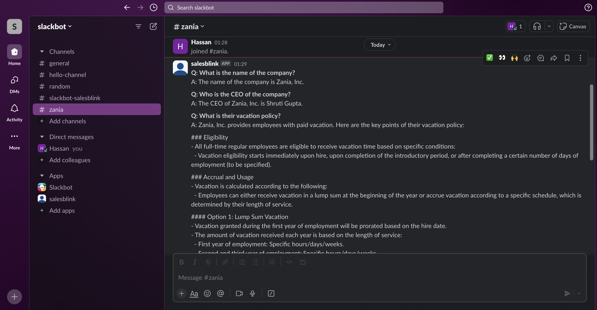

# PDF QA AGENT

This project is an AI agent that extracts answers from a large PDF document and posts results on Slack. It leverages OpenAI's gpt-4o-mini model for question answering and integrates with Slack using the Slack SDK.

## Demo Video
Here is a [demo video](public/pdf-qa-agent-sample.mov) showing the application working.

## Result Screenshot



## Features

- Extract text from PDF documents.
- Answer specific questions based on the content of the PDF.
- Post the answers to a specified Slack channel.


## Getting Started

### Prerequisites

- Python 3.7+
- An OpenAI API key
- A Slack API token

### Installation

1. Clone the repository:

   ```
   git clone https://github.com/Hasn-Khan/pdf-qa-agent
   cd pdf-qa-agent
   ```
2. Install the required dependencies:
    ```
    pip install -r requirements.txt
    ```
3. Set up environment variables:
   - Create a .env file in the root directory of the project and add your API keys:
   ```
   OPENAI_API_KEY=your_openai_api_key
   SLACK_TOKEN=your_slack_token
   SLACK_CHANNEL_ID=your_slack_channel_id
   ```

### Running the Application & Usage

  1. Update the main.py file with the path to your PDF and the questions:
  ```
  pdf_path = 'path/to/your/pdf/document.pdf'
  questions = ["What is the main topic?", "Who is the author?"]
  ```

  2. Run the script:
  ```
  python main.py
  ```
